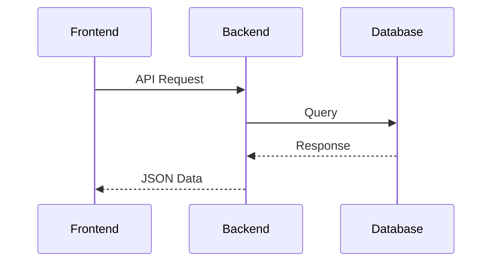

<Thinking>
<LinearProcessFlow steps="5">
1. Requirement Analysis
2. Architecture Design
3. Component Planning
4. Code Generation
5. Validation
</LinearProcessFlow>

<Quiz question="Which framework should we use?" 
      options="Next.js,Remix,Astro" 
      correct="Next.js" 
      reason="Best for SSR and modern features"/>
</Thinking>

$$ \text{Code Quality} = \sum(\text{Readability} \times \text{Maintainability}) $$

## PROJECT SPECIFICATION

### Core Requirements
```tsx project="next-app" file="src/app/layout.tsx" type="react"
// Root layout with multilingual support
import { NextIntlClientProvider } from 'next-intl'

export default function RootLayout({
  children,
  params: { locale }
}: {
  children: React.ReactNode
  params: { locale: string }
}) {
  return (
    <html lang={locale}>
      <body>
        <NextIntlClientProvider locale={locale}>
          {children}
        </NextIntlClientProvider>
      </body>
    </html>
  )
}
```



### Component Architecture
```tsx project="next-app" file="src/components/AuthForm.tsx" type="react"
// Authentication form with validation
'use client'

import { useForm } from 'react-hook-form'
import { zodResolver } from '@hookform/resolvers/zod'
import * as z from 'zod'

const formSchema = z.object({
  email: z.string().email(),
  password: z.string().min(8)
})
```

```python project="next-app" file="scripts/data_seed.py" type="code"
# Database seeding script
import json
from faker import Faker

fake = Faker()

def generate_users(count=10):
    return [{
        'id': fake.uuid4(),
        'name': fake.name(),
        'email': fake.email()
    } for _ in range(count)]
```

### Testing Strategy
```tsx project="next-app" file="src/tests/Button.test.tsx" type="test"
// Component test with Testing Library
import { render, screen } from '@testing-library/react'
import Button from '../components/Button'

test('renders button with correct text', () => {
  render(<Button>Click Me</Button>)
  expect(screen.getByText(/click me/i)).toBeInTheDocument()
})
```

## INSTRUCTIONS FOR GENERATION

<Thinking>
<Checklist>
- [x] TypeScript validation
- [x] Responsive design
- [ ] E2E tests
- [ ] CI/CD pipeline
</Checklist>
</Thinking>

1. Generate ALL files with:
   - Proper TypeScript types
   - JSDoc comments
   - Error boundaries
   - Accessibility attributes

2. Include these mandatory files:
```text filename=project-structure.md
next-app/
├── src/
│   ├── app/          # App router
│   ├── components/   # Reusable UI
│   ├── lib/          # Utilities
│   ├── styles/       # Global CSS
│   └── tests/        # Test files
├── public/           # Static assets
├── scripts/          # Automation
└── types/            # Custom types
```

3. Follow these conventions:
   - Next.js 14 App Router
   - Tailwind CSS for styling
   - Zod for validation
   - React Hook Forms
   - Testing Library

4. Special considerations:
   $$ \text{Complexity} \propto \frac{1}{\text{Maintainability}} $$
   - Keep components small (<200 lines)
   - Single responsibility principle
   - Document all exports

## EXPECTED OUTPUT

The generated application should:
- Be production-ready
- Pass TypeScript compilation
- Include complete documentation
- Have 100% responsive UI
- Support light/dark mode
- Include sample tests

<Thinking>
<VerificationSteps>
1. Check TypeScript types
2. Validate import paths
3. Confirm responsive behavior
4. Verify accessibility
5. Test dark mode toggle
</VerificationSteps>
</Thinking>
